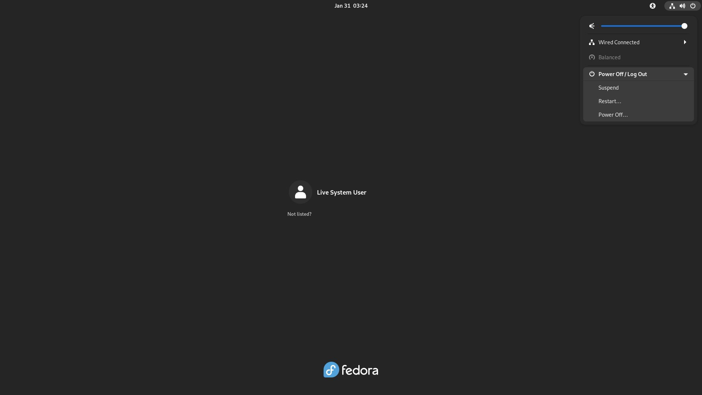
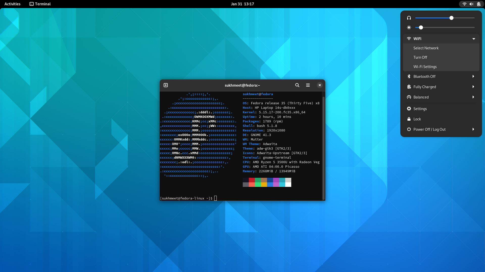
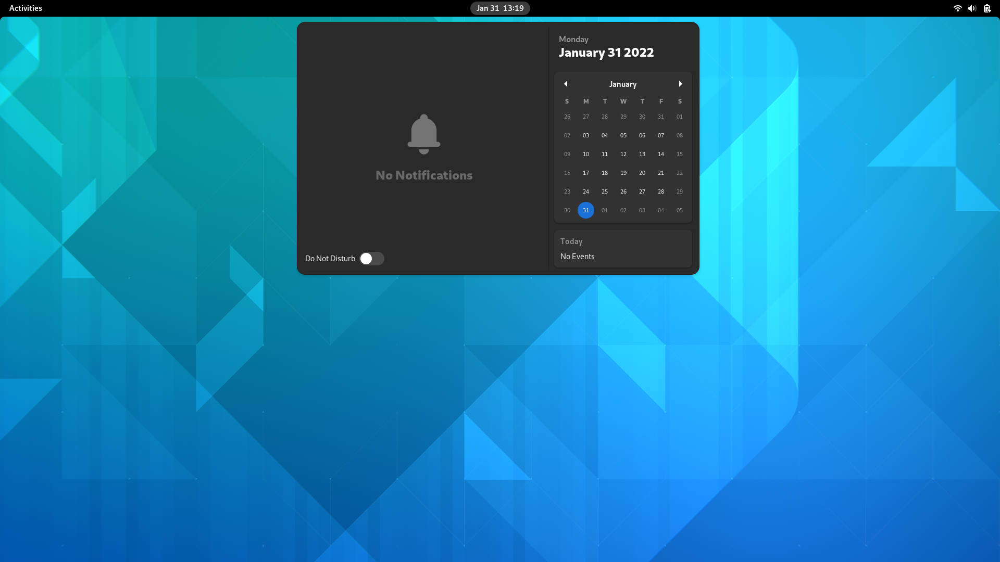

# shell-theme-42
Installs Latest Gnome Shell Theme to make it look like GNOME 42.

# Installation

## Cautions (Only for System Wide Installation i.e. for GDM)

- If the replacement fails, your desktop environment will not work properly. So please **be careful** if doing this.
- When applying this, other third-party GNOME Shell themes would look broken until you restore to the original theme.
- If GNOME Shell has been updated and restored to the original theme, you will need to install this again.

## Requirements

- `glib-compile-resources` — The package name depends on the distro. This is only needed for systemwide install.
  - `glib2` (Arch Linux)
  - `glib2-devel` (Fedora, openSUSE, etc.)
  - `libglib2.0-dev-bin` (Debian, Ubuntu, etc.)
- `sassc`
- `git`

 ##  Usage

 - `git clone https://github.com/sukhmeetbawa/shell-theme-42.git`
 - `cd ./shell-theme-42/`
 - `./install-gdm-theme.sh` For system-wide install\
 - `./install-gdm-theme-local.sh` For local-install\
 For local install you can get rid of rounded corners using just-perfection extension.\
 
# Uninstall
  
  - `./install-gdm-theme.sh restore`
  or
  - `sudo mv /usr/share/gnome-shell/gnome-shell-theme.gresource{~,}`

# Screenshots
## GDM

## Gnome Shell

